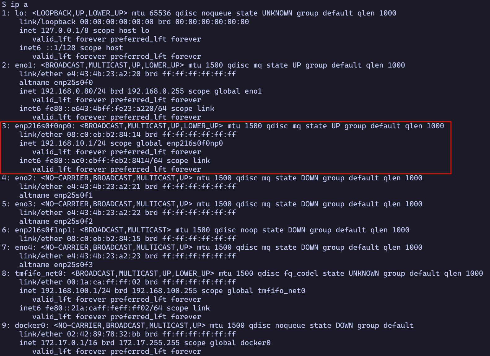
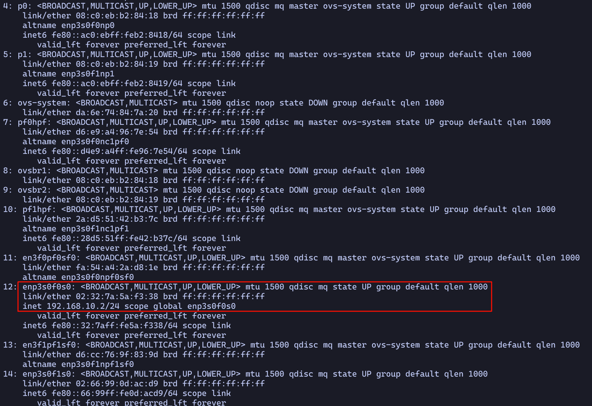
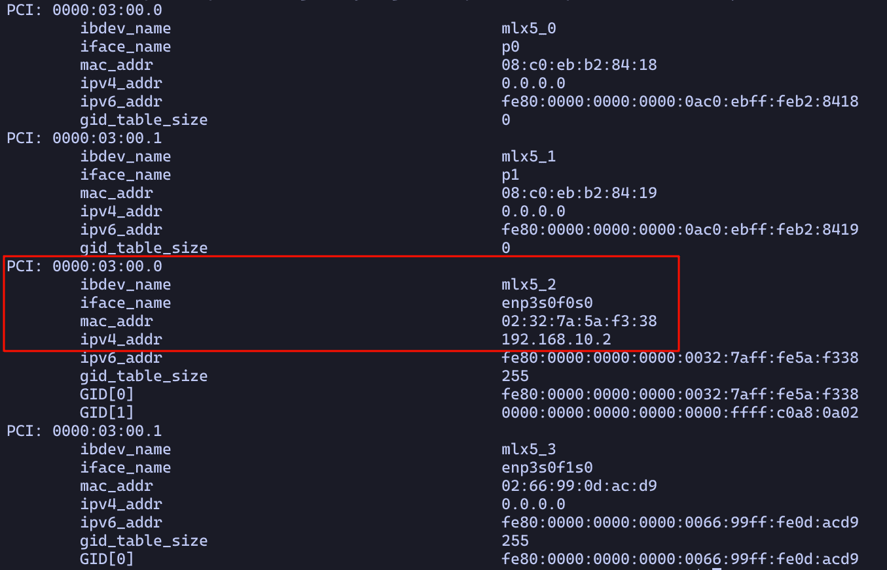
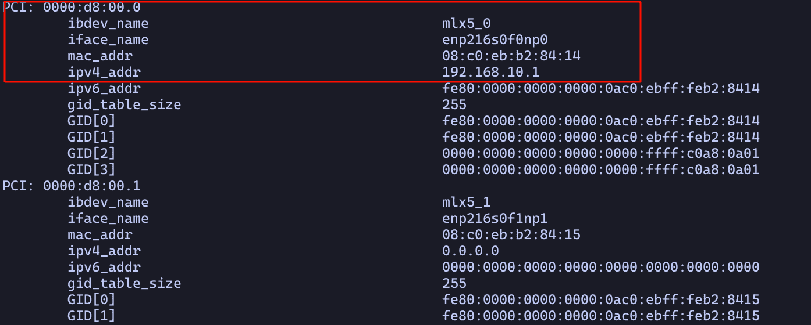

# DPU channel latency measurement

This code is adapted from the security\_channel example from [DOCA applications](https://docs.nvidia.com/doca/sdk/nvidia+doca+secure+channel+application+guide/index.html).

In this code, DPU will host a server and the Host will start a client.

First, we should build this code individually on Host and DPU side to get the `DPU_channel` binary under `./build/`.

Second, we should invoke the python script to run the experiment, which will automatically involve the binary on different settings and aggregate the results for us.

## environment setup

We can run this code snippet to test if we set it correct or not.

```bash
if pkg-config --exists doca-argp; then
    echo "doca-argp is installed."
else
    echo "doca-argp is not installed."
fi

```

If this shows `doca-argp is not installed`, then either the DOCA environment is not setup or the `PKG_CONFIG_PATH` environment variable is not properly set.

If it is the first case, please setup the DOCA environment first with [this link](https://docs.nvidia.com/doca/sdk/nvidia+doca+installation+guide+for+linux/index.html).

If it the second case, we need to add the directory of library to `PKG_CONFIG_PATH`.

Normally it is already included in the variable. We can check by `echo $PKG_CONFIG_PATH`.

If the `$PKG_CONFIG_PATH` is not set, we should manually set it with the following steps.

If you are on Host, the doca library is located at `/opt/mellanox/doca/lib/x86_64-linux-gnu/`.
We should export with

```bash
export PKG_CONFIG_PATH=/opt/mellanox/doca/lib/x86_64-linux-gnu/pkgconfig/:$PKG_CONFIG_PATH
```

If you are on DPU, the doca library is located at `/opt/mellanox/doca/lib/x86_64-linux-gnu/`.
We should export with

```bash
export PKG_CONFIG_PATH=/opt/mellanox/doca/lib/aarch64-linux-gnu/pkgconfig/:$PKG_CONFIG_PATH
```


## compile

Then we can compile the code with

```bash
meson setup build
ninja -C build/

```

We can verify the compiled binary with `./build/DPU_channel -h`

## determine device PCIe address

The security channel is between a DOCA device from DPU and a DOCA device on the Host.
We should specify the PCIe address.

Take the following setting as an example.

On the host side, we run `ip a` and get the following result.


On the DPU side, we run `ip a` and get the following result.


Notice here we already assigned proper IP to the device `enp216s0f0np0` on host and device `enp3s0f0s0` on the DPU. The can use TCP to talk to each other.

Then we can use the `/opt/mellanox/doca/tools/doca_caps --list-devs` on the DPU and host respectively to get the doca device list and their PCIe location.

Bellow are the result from DPU and host respectively.




We can know the doca device on the host have PCIe address of `0000:d8:00.0`, the doca device on the DPU have address of `0000:03:00.0`

Then we can test the PCIe address's correctness by doing the following test.

```bash
# on the DPU
./build/DPU_channel -s 4 -n 10 -p 0000:03:00.0 -r 0000:d8:00.0
# on the host
./build/DPU_channel -s 4 -n 10 -p 0000:d8:00.0
```

Note the DPU needs the `-p` to be the address of local DOCA device and the `-r` to be the remote DOCA device.
We need to start the DPU side first, then the host side.


