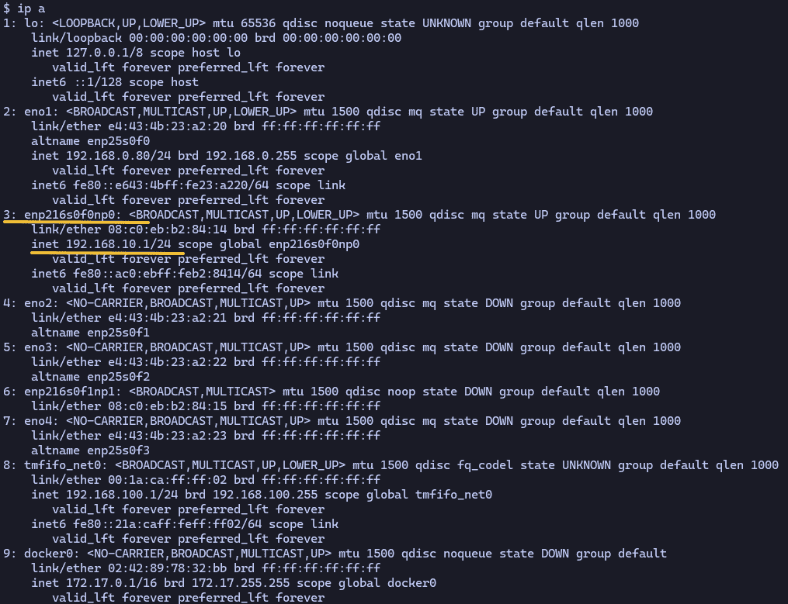
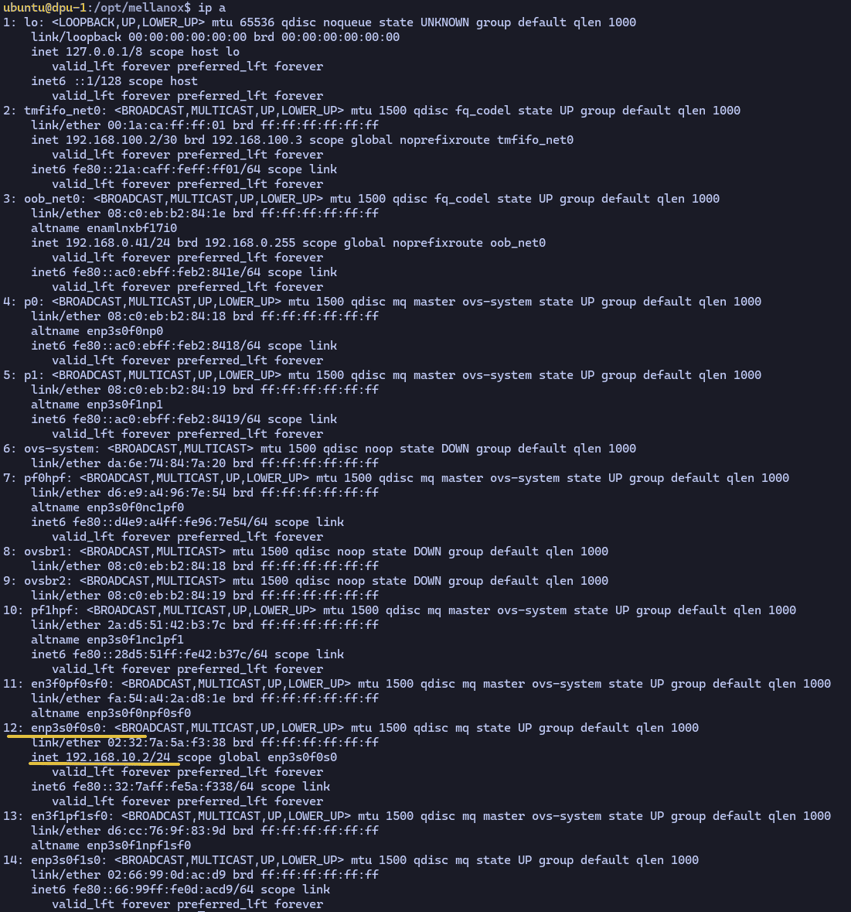
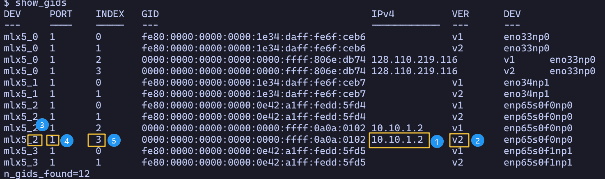

# DPU-host-latency

This experiment tests necessary latency values of different communication channel between DPU and host.

## Run the experiment

### setup the DPU and host interface IP

First, we need to setup two endpoints on DPU and host respectively and make sure they can connect to each other.

On the Host side, we can set up a IP for the pf interface is it is not set yet.

```
sudo ip addr add 192.168.10.1/24 dev enp216s0f0np0
```



For DPU, we can use interfaces which is suffixed by `s<number>`

```
sudo ip addr add 192.168.10.2/24 dev enp3s0f0s0
```



Then make sure they can ping each other 

### RDMA latency test


#### determine RDMA specific settings

The `-d`, `-x` and `-i` setting specifies the RDMA device index, sgid index and ip port settings. These settings should be adjusted on a per node basis.

Please follow the following steps to determine these values.


1. determine a interface to use, note the interfaces on two nodes should in same IP sub network so they can talk to each other.

2. Choose the row with v2 instead of v1, which stands for RoCEv2 support.

3. determine the device index, which is number in yellow square labeled 3, and the full name of the device.

4. determine the ip port setting(`-i`), which is the number in the yellow sqare labeled 4.

5. determine the sgid index setting(`-x`), which is the number in the yellow sqare labeled 5.

For example, follow the setting in the picture, we should be using `python exp1.py --n_core 16 --n_qp 128 -x 3 -i 1 -d 2` on the server node and `python exp1.py --n_core 16 --n_qp 128 -x 3 -i 1 -d 2 --server_ip 10.10.1.1` on the client node.

#### use ib_send_lat tool

The command we will use will be like `ib_send_lat -d mlx5_0 -i 1 -x 3 192.168.10.2 -a`

change the `-d` with the device name we will use.
change the `-i` with the ib port we will use.
change the `-x` with the sgid index we will use.

Then on the DPU side, issue

```
ib_send_lat -d mlx5_0 -i 1 -x 3 -a
```

On the host side, issue

```
ib_send_lat -d mlx5_0 -i 1 -x 3 192.168.10.2 -a
```

Replace the IP with the DPU endpoint we setted up.

### TCP latency test

#### install netperf

use `sudo apt install netperf` on host and DPU to install the netperf.

#### start netperf server on DPU

use `netserver -L <server_ip> -p <server_port>` to start a srever on the DPU side. 

#### run test with different size of requests


#### run 
### experiment specific setting

For our experiment, we will fix `-p`, which is the message to send, as `2000000`

We will change the `-t` setting of the client and server, which allocate threads and should be the same cross two side.

For each setting, start the server by `./bin/sharing --local_ip 10.10.1.1 --port 10001 -i 1 -x 3 -d 2 -p 2000000 -t <number> >> result.txt`
For each setting, start the client by `./bin/sharing --port 10001  -i 1 -x 3 -d 2 --server_ip 10.10.1.1 -p 20000000 -t <number>`

Then run with different `-t` settings

**NOTE: run one server side command first, then run the corresponding client side command, wait untill the client finished, then repeat**
**THe result will be collected in the result.txt file**
**The following command use the relative path from the palladium-gateway base directory**

**The `-l` will run the program without lock**
```bash
# on the server side
./bin/sharing --local_ip 10.10.1.1 --port 10001 -i 1 -x 3 -d 2 -p 20000000 -l >> result.txt
# on the client side
./bin/sharing --port 10001  -i 1 -x 3 -d 2 --server_ip 10.10.1.1 -p 20000000 -l
```

```bash
# one thread with lock
# on the server side
./bin/sharing --local_ip 10.10.1.1 --port 10001 -i 1 -x 3 -d 2 -p 20000000 -t 1 >> result.txt
# on the client side
./bin/sharing --port 10001  -i 1 -x 3 -d 2 --server_ip 10.10.1.1 -p 20000000 -t 1
```

```bash
# two thread with lock
# on the server side
./bin/sharing --local_ip 10.10.1.1 --port 10001 -i 1 -x 3 -d 2 -p 20000000 -t 2 >> result.txt
# on the client side
./bin/sharing --port 10001  -i 1 -x 3 -d 2 --server_ip 10.10.1.1 -p 20000000 -t 2
```

Run the program with `-l` flag on both side, then run the program with `-t` value from list `[1, 2, 4, 8, 16, 32, 64, 128]`
